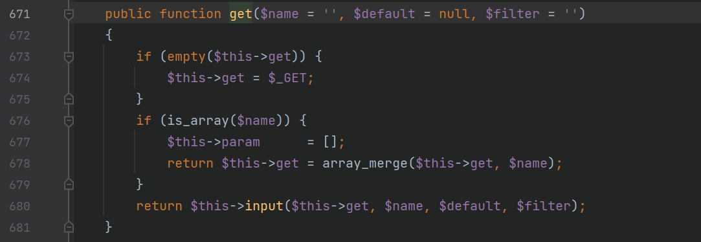
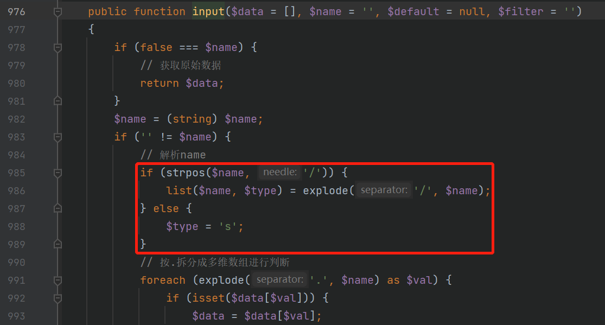
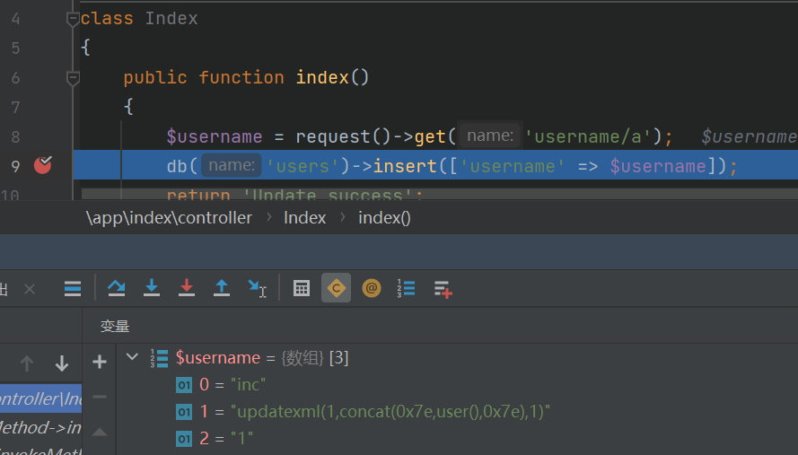
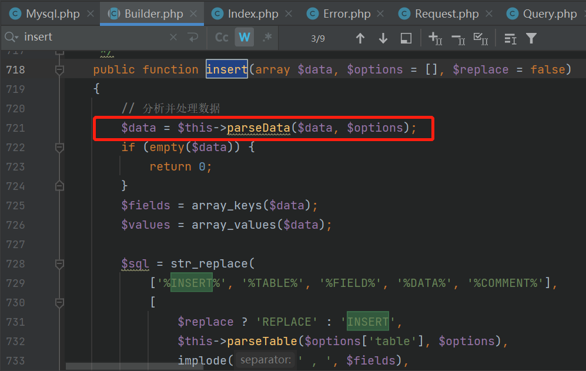
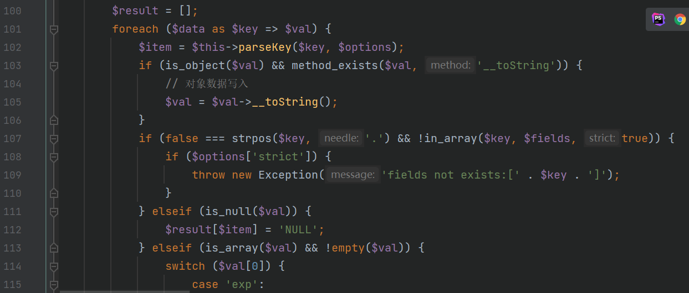
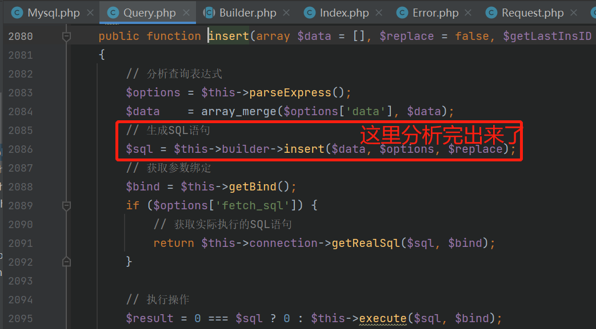

# ThinkPHP5 之 SQLI审计分析（一）

**Time：8-31**

**影响版本：5.0.13<=ThinkPHP<=5.0.15、 5.1.0<=ThinkPHP<=5.1.5**

**Payload：**

```
/public/index.php/index/index?username[0]=inc&username[1]=updatexml(1,concat(0x7,user(),0x7e),1)&username[2]=1
```

这是一篇由已知漏洞寻找利用过程的文章，跟着**[参考链接](https://github.com/hongriSec/PHP-Audit-Labs/blob/master/Part2/ThinkPHP5/ThinkPHP5%E6%BC%8F%E6%B4%9E%E5%88%86%E6%9E%90%E4%B9%8BSQL%E6%B3%A8%E5%85%A51.md)**学习分析，以下是收获记录。

---

### 0x00 测试代码做了什么？

```php
<?php
namespace app\index\controller;

class Index
{
    public function index()
    {
        $username = request()->get('username/a');
        db('users')->insert(['username' => $username]);
        return 'Update success';
    }
}
```

index控制器是默认的TP框架程序的入口，该测试代码在index控制器下新建了一个index方法（实际上本来的index方法是tp的欢迎页面，这里是覆盖替换掉原来的）。逐行来看该测试代码：获取`get`请求的`username`参数->进行数据库的`insert`操作->输出`Update success`。

其中，`username/a`不明白是什么意思，就跟进`get`方法去看一下它怎么处理的：

**thinkphp/library/think/Request.php**



**第676行**可以看到`$name`允许是一个数组，但是测试代码中传入的是`username/a`字符串。**674行**以`GET`方式接受的数据最后进入`input`方法，接着看下做了如何处理：



这里看到将`$name`参数以`/`分割为了`$name`和`$type`,而`$type`接下来被用到的地方是强制类型转换：


到这里就知道了`a`是一种修饰符，查看[开发手册](https://www.kancloud.cn/manual/thinkphp5/118044)得知所有的定义好的修饰符。


同样的下断点看也可以证明`$username`最后其实是一个数组：（并不是因为payload是数组形式，而是由/a修饰符决定的）



然后接下来就进入到执行数据库插入操作的`insert`方法了。（**9行**这条代码的意思是向users表的username字段插入$username）

### 0x01 调用链分析

现在已知`$username`是一个数组，传入`insert`方法。跟进`insert`跳到：

**thinkphp/library/think/db/Query.php**


发现其内又调用了`$this->builder->insert`方法，且**注释**是生成SQL语句。文件内搜索看看`builder`是如何定义的：


为了方便，直接在**130行**下断点，得到了`$class`的值：（这里可以随便传个参数比如username=1进去，因为主要是为了知道调用的哪里）


所以，`$this->builder`实际上是一个`Mysql`类的对象，而`Mysql`类**(thinkphp/library/think/db/builder/Mysql.php)**是继承于`Builder`类的，且`Mysql`类里面并没有实现`insert`方法，所以最终调用的还是`Builder`类的`insert`方法:

**thinkphp/library/think/db/Builder.php**



经过上述跟进代码分析，最终得知，入口调用的`insert`方法最终调用的实际上是调用的`Builder->insert()`方法来生成SQL语句。接下来应该由内向外分析看看有没有什么有效的过滤措施。

### 0x02 分析最内层调用的处理

分析这个*生成SQL语句*（之前有个注释）的方法具体做了什么，跟进它的`parseData`方法：（**86行**）

```php
	protected function parseData($data, $options)
    {
        if (empty($data)) {
            return [];
        }

        // 获取绑定信息
        $bind = $this->query->getFieldsBind($options['table']);
        if ('*' == $options['field']) {
            $fields = array_keys($bind);
        } else {
            $fields = $options['field'];
        }

        $result = [];
        foreach ($data as $key => $val) {
            $item = $this->parseKey($key, $options);
            if (is_object($val) && method_exists($val, '__toString')) {
                // 对象数据写入
                $val = $val->__toString();
            }
            if (false === strpos($key, '.') && !in_array($key, $fields, true)) {
                if ($options['strict']) {
                    throw new Exception('fields not exists:[' . $key . ']');
                }
            } elseif (is_null($val)) {
                $result[$item] = 'NULL';
            } elseif (is_array($val) && !empty($val)) {
                switch ($val[0]) {
                    case 'exp':
                        $result[$item] = $val[1];
                        break;
                    case 'inc':
                        $result[$item] = $this->parseKey($val[1]) . '+' . floatval($val[2]);
                        break;
                    case 'dec':
                        $result[$item] = $this->parseKey($val[1]) . '-' . floatval($val[2]);
                        break;
                }
            } elseif (is_scalar($val)) {
                // 过滤非标量数据
                if (0 === strpos($val, ':') && $this->query->isBind(substr($val, 1))) {
                    $result[$item] = $val;
                } else {
                    $key = str_replace('.', '_', $key);
                    $this->query->bind('data__' . $key, $val, isset($bind[$key]) ? $bind[$key] : PDO::PARAM_STR);
                    $result[$item] = ':data__' . $key;
                }
            }
        }
        return $result;
    }
```

这个函数最后return了`$result`变量，那么我们就看看函数体内是怎样处理`$result`变量的：

①首先，这个函数的第一个参数是`$data`，来源于最开始`Query.php`中`insert`方法的2084行:


进行了一个数组合并操作把合并的结果再赋给`$data`，那么合并后的`$data`也是一个数组，且有一个键的键名为username（因为`$data`本来是`['username' =>$username]`，在入口的**第9行**）。

②然后，这个函数在**100行**初始化了`$result`变量，然后**101行**用foreach分离`$data`为`$key`和`$val`，`$key`变成了`$item`:



此时的`$val`是可控的、`get`方式传入的、等价于`$username`。**第113行**判断如果`$val`是个数组，进入switch分支


`$val[0]`也就是payload中的`username[0]`根据不同的值进入不同的三个分支，但是可以看到每个分支的处理都是直接拼接`$val[1]`和`$val[2]` 赋给 `$result[$item]`，也就是`$result['username']`，唯一调用的`parseKey`并没有什么作用：


③最后，返回`$result` (也就是赋值给`Query.php`中`insert`方法2084行的`$data`)，至此`parseData`的主要功能就分析的差不多了。

接着看`Builder`类的`insert`方法在调用了`parseData`之后又干了什么：


从`$data`中取出键值分别赋值给代表字段名和字段值的变量，简单的替换**29-33行**定义的SQL语句模型，返回生成好的SQL语句。


### 0x03 分析上一层调用的处理



之后还有两处调用函数，即`getBind()`和`getRealSql()`但是跟进去看了下都没有任何数据清洗，仅仅是数据处理的一些解析操作。然后就到了`execute()`去执行SQL语句了。至此，整个处理流程基本上就分析完了，满足SQL注入漏洞的前提条件：①参数用户可控②参数直接拼接到SQL语句中，无任何有效过滤。

### 0x04 Payload构造

漏洞的利用点还是在最内层调用的`parseData`方法中，根据刚才的分析已经知道的$val实际上就是传入的username，那么`$val[0]`、`$val[1]`、`$val[2]`都是可控的，只要传入满足条件的值即可，因为是insert操作，所以选择用报错函数进行注入：

构造`username[0]=inc`，进入inc分支。

构造`username[1]=updatexml(1,concat(0x7e,user(),0x7e),1)`，实际的报错语句。

构造`username[2]=1`，只是为了补齐数组元素个数。

再加上index控制器的index方法的访问路径`/public/index.php/index/index/`

最后连起来就是

```
/public/index.php/index/index/?username[0]=inc&username[1]=updatexml(1,concat(0x7e,user(),0x7e),1)&username[2]=1
```

本意是代码审计，就不考虑再如何利用了。